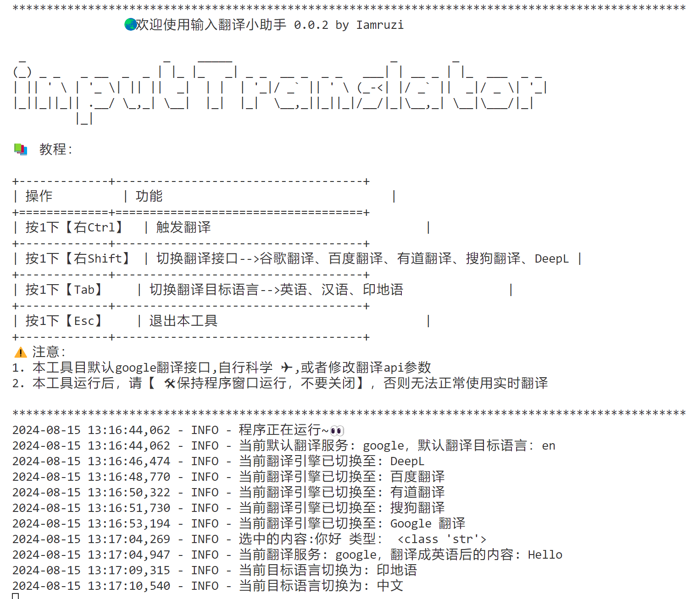

# inputTranslator 输入翻译小助手 💁

输入翻译助手，你只需要触发热键（例如大键盘右侧的Ctrl），即可轻松编辑框中内容翻译成指定语言。

节省你跨软件操作的时间。和异国友人轻松对话。



## ❓解决什么问题？

我需要一款输入后翻译的小助手，在聊天中方便我快速翻译回复，不想跨软件操作。

但是，目前网上没有一款好用的软件，手机端百度和微信的输入法支持此需求，但我大部分使用场景在PC端，于是有了这个工具。

日常使用场景：

- 复制--翻译--粘贴，

- 划词--翻译--复制--粘贴

有了这个工具，我只要在编辑框中输入内容，按下热键，即可完成翻译。

对你多少有点帮助的话，点个star⭐吧。

### 🔦 其他工具推荐

如果你接受语音翻译，大把的工具可以使用，推荐使用讯飞输入法，全平台支持，而且免费。

如果是手机端边写边翻译，推荐百度输入法、微信输入法。

如果是PC端，毛遂自荐一下，推荐📌我这个。


## 🌟 项目简介

**实时输入翻译小助手**是一个基于Python的键盘监听工具，能够实时翻译用户选择的文本内容。

目前支持（我只需要用到的三种，更多自己改）**中文**、**英语**、**印地语**。

用户可以通过按下特定的键盘组合来切换语言、切换翻译接口、触发翻译或退出程序。

默认使用谷歌（免费，哈哈😁），其他接口，函数写好了，自己解决token之类的东西。

## ❤ 实现原理

实时检测用户键盘输入，当按下特定的热键后（如下图Ctrl）：


软件经历的流程

- 1. 全选当前编辑框中的内容，并复制到剪贴板。
- 2. 获取剪贴板中的内容，传给翻译接口，并翻译成指定语言。
- 3. 将翻译结果粘贴到当前光标位置。

## 🛠 版本说明

- **v0.0.1**: 第一版本完成基本功能，基于googletrans4.0.0-rc1谷歌翻译源（免token使用），支持三种个人需要的语言切换、固定热键翻译。
  
- **v0.0.2**: 接入更多翻译接口，使得翻译更加得体。

## 🛠 功能概述

- **语言切换**: 按下 `Tab` 键可在三种语言（中文、英语、印地语）之间循环切换。
- **翻译接口切换**: 按下 `左Shift` 键可在三种翻译接口（谷歌、百度、必应）之间循环切换。
- **实时翻译**: 按下 `右Ctrl` 或 `Alt` 键将会触发翻译功能，翻译剪贴板中的内容并将翻译结果粘贴到当前光标位置。
- **退出程序**: 按下 `Esc` 键退出程序。


## 安装/运行/打包说明

### 📦 库安装

注意：googletrans 库版本可能会更新，如果遇到问题，请安装指定版本 4.0.0-rc1。
```bash
# 主要依赖库
pip install pynput pyperclip googletrans==4.0.0-rc1
```
```bash
# 其他
pip install requests tabulate art

```

### 🚀 运行方法
注意：安装好依赖库后，直接运行 `xx.py` 即可。
```bash
python inputTranslator.py
```

### 📦 打包执行文件方法
```bash
pip install pyinstaller
```

```bash
pyinstaller --onefile inputTranslator.py
```

运行后，可以最小化到后端运行，不要关闭就可以了。

## 📜 版权声明

本项目版权归作者所有，未经授权不得用于商业用途。

## 📨 问题建议

如果用户有任何问题或建议，可以提issue。
